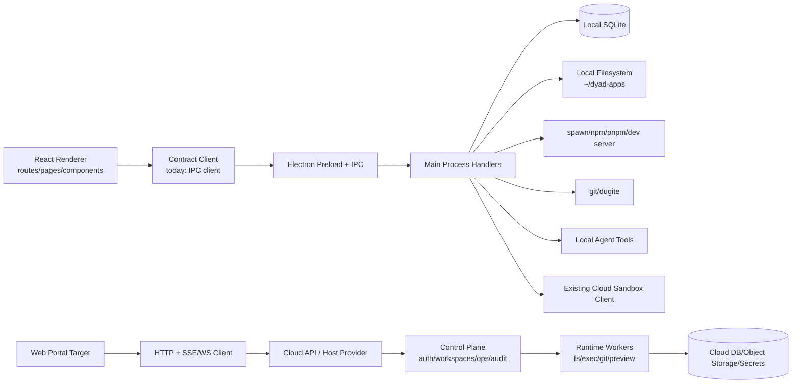

## 问题与范围

这次探索回答两个问题：

1. 当前 repo 的主要技术栈和架构边界是什么？
2. 如果迁移到 Web portal/browser-first 版本，现有系统哪些可以复用，哪些必须抽象或重建？

范围覆盖桌面壳、renderer、IPC 合约、主进程服务、数据/设置/路径、运行时和 local agent；不深入逐个 UI 组件或每个 IPC handler 的业务细节。

## 速答

Dyad 当前是 Electron 桌面应用：React renderer 已经比较 Web 化，但产品能力被主进程承载。主进程负责本地 SQLite、设置/密钥、本地文件路径、git、child process、dev server/preview、terminal、agent tools 和外部集成。迁移到 Web portal 的核心不是“把 React 路由搬到浏览器”，而是把 `Electron IPC + 本地 OS 能力` 抽成 `Host/API/Runtime` 边界。

现有最可复用的部分：

- React 19 + TanStack Router 页面/组件结构。
- `src/ipc/types/*` 的 Zod 合约、输入输出类型和 stream/event 语义。
- Drizzle schema 的领域模型雏形。
- chat/tag parser、prompt、agent loop 的部分领域逻辑。
- 已有 cloud sandbox/client path 的经验和测试思路。

必须重构或重建的部分：

- `createClient/createStreamClient` 现在直接依赖 `window.electron.ipcRenderer`，Web 需要 HTTP + SSE/WebSocket adapter。
- `src/ipc/handlers/*` 现在是 Electron `ipcMain.handle` handler，Web 需要抽纯 service，再分别接 IPC 和 HTTP。
- 本地 SQLite/`user-settings.json`/`safeStorage`/`~/dyad-apps` 要拆成 desktop local provider 与 cloud DB/secret/object storage。
- 本地 process/git/npm/terminal/preview 要迁移到云 runtime worker 或 host capability。
- 多租户 Web 需要 auth、workspace/project ownership、RBAC、operation audit、quota/rate limit。

## 关键证据

1. `package.json:15-50` 显示当前 app main entry 是 `.vite/build/main.js`，运行/打包走 Electron Forge；`package.json:52-144` 同时包含 AI SDK、Electron-adjacent、本地 DB、React/TanStack、Monaco、xterm、node-pty、Vercel/Neon/Supabase 等依赖；这支撑“桌面壳 + React 前端 + 主进程后端”的技术栈判断。
2. `docs/architecture.md:7-21` 明确描述 Dyad 是 Electron app，renderer 通过 IPC 与 privileged main process 通信，核心流程是 LLM 输出 dyad tags，renderer 展示，main process 执行文件/依赖等变更。
3. `src/main.ts:179-180` 在 app ready 前注册全部 IPC handlers；`src/ipc/ipc_host.ts:51-101` 集中注册 40+ handler 类别，说明主进程是大量业务能力的后端入口。
4. `src/preload.ts:30-85` 只向 renderer 暴露 allowlist 后的 `ipcRenderer.invoke/on` 和 `webFrame`，`src/ipc/contracts/core.ts:154-170`、`src/ipc/contracts/core.ts:260-365` 的 client/stream client 直接调用 `window.electron.ipcRenderer`；这说明 Web 迁移的第一层阻塞是 transport adapter。
5. `src/db/index.ts:22-85` 使用 `better-sqlite3` + Drizzle 在 `getUserDataPath()/sqlite.db` 初始化并运行迁移；`src/db/schema.ts:47-175` 的核心表是 apps/chats/messages/versions，且 apps 记录本地 path、GitHub、Supabase、Neon、Vercel 等集成字段。这说明 schema 可复用，但 Web 需要多租户和云存储语义。
6. `src/main/settings.ts:93-240` 把设置和 crash record 存在 userData 下 JSON 文件，且引入 Electron `safeStorage`；`src/paths/paths.ts:16-92` 默认项目根是 `~/dyad-apps` 或用户设置的本地目录。这说明 settings/secrets/path provider 必须平台化。
7. `src/ipc/services/app_runtime_service.ts:189-233` 根据 `runtimeMode2` 分派 host/docker/cloud；`src/ipc/services/app_runtime_service.ts:347-440` local mode 直接 `spawn` npm/pnpm dev server，`src/ipc/services/app_runtime_service.ts:476-536` 处理 cloud sandbox sync 通知。这说明运行时已经有 cloud 概念，但仍被 Electron event/WebContents 和本地 path 绑定。
8. `docs/adrs/0001-host-capability-interface.md:8-27`、`docs/adrs/0002-cloud-runtime-topology.md:19-60`、`plans/multi-platform-web-and-mobile.md:134-175` 已经提出 Host Capability、control-plane/worker-plane、IPC 合约转 HTTP/SSE 的方向；这些计划与代码现状一致，说明迁移主轴已有设计雏形。

## 细节展开

### 技术栈现状

前端/renderer：

- React 19、React DOM、TanStack Router、TanStack Query、Jotai、Tailwind v4、Base UI、Monaco、Lexical、xterm、Konva 等。
- 路由是显式 TanStack route tree：`src/router.ts:1-26` 包含 home/chat/settings/app-details/hub/library/apps/themes/prompts/media。
- 这部分整体接近普通 SPA，Web 复用成本相对低。主要风险来自组件内部调用 IPC client、窗口/本地文件/preview/terminal 相关 UI capability。

桌面壳/主进程：

- Electron Forge + Vite 构建。
- `src/main.ts` 处理 crash reporter、deep link、auto update、native protocol、数据库初始化、media protocol、git safe.directory、window lifecycle 等桌面职责。
- `src/preload.ts` 是 renderer 到 main 的唯一暴露桥。

IPC/API 层：

- 合约层有价值：`defineContract/defineEvent/defineStream` 同时持有 channel、Zod input/output、stream events。
- 当前 client generator 是 Electron-only，handler base 也是 `ipcMain.handle` only。
- Web portal 可以保留 `src/ipc/types/*` 作为 API contract source，但要把 `createClient/createEventClient/createStreamClient` 抽成 transport-aware client。

数据层：

- Local DB 是 `better-sqlite3` + Drizzle migrations。
- 领域核心是 app/chat/message/version，以及 providers/models/prompts/MCP/integration/theme 等扩展表。
- Web 需要至少增加 user/workspace/project ownership 维度，并决定 SQLite-per-user、Postgres multi-tenant 或两阶段方案。

运行时/preview：

- Local host 跑 `npm/pnpm install && dev --port`，并通过 proxy worker 给 iframe 使用稳定 origin。
- 已有 `runtimeMode2: "cloud"` 路径和 cloud sandbox provider，但当前 cloud 仍像桌面功能的一种远端执行模式，不是完整 Web backend。
- `plans/sandbox-gaps.md:7-108` 已列出 cloud mode 的缺口：env restart、stdin/input bridge、lifecycle policy、crash cleanup、structured status/error、coverage。

Local agent：

- Agent v2 使用 Vercel AI SDK tool calling；`docs/agent_architecture.md:3-6` 指出核心 loop 在 `local_agent_handler.ts`，工具列表在 `tool_definitions.ts`。
- `src/pro/main/ipc/handlers/local_agent/tool_definitions.ts:74-109` 包含 write/search/delete/rename/add dependency/SQL/read files/logs/web fetch/image/typecheck/MCP/plans 等工具。
- 这批工具大多是 host capabilities 的直接消费者，Web 不能让 browser 执行它们，需要在 cloud runtime worker/service 侧执行，并保留 consent/approval/audit。

### Web Portal 迁移要做的事情

1. 建立 Host/API 边界。

   代码现状和 ADR 都指向同一个方向：定义 `HostProvider`/capability layer，把 project fs、exec、git、preview、integration、system、session 从 Electron IPC handler 中抽出来。Desktop 用 `ElectronLocalHostProvider`，Web 用 `CloudHostProvider`。

2. 把 IPC contract 升级为 transport-agnostic API contract。

   不是删掉 `src/ipc/types/*`，而是保留 Zod 合约，新增：
   - IPC adapter：现有 desktop 调用路径。
   - HTTP adapter：invoke/response 变 POST。
   - SSE/WebSocket adapter：stream/event 变 chunk/end/error event model。
   - 统一 error envelope/correlation id/idempotency key。

3. 抽离 handler 中的业务逻辑。

   当前 handler 注册面很大。迁移时不宜一次改 40+ handler，应先选关键闭环：
   - app create/import/list/detail
   - chat stream
   - response apply/file mutation
   - run preview/log stream
   - git status/commit basics
   - settings/provider key read-write

   每个 endpoint 的目标形态是 `pure service + desktop IPC wrapper + web HTTP route`。

4. 设计 Web 数据模型。

   当前表缺 user/workspace ownership。Web 至少需要：
   - users/accounts/sessions
   - workspaces/projects
   - project_hosts/runtime_instances
   - operations/operation_logs
   - credentials/secrets
   - usage/quota/billing counters

   现有 apps/chats/messages/versions 可以作为 project/chat/message/version 的起点，但 app.path 不能再是云端主标识。

5. 替换本地 settings/secrets。

   Desktop 保留 `user-settings.json + safeStorage`。Web 需要：
   - 非敏感设置入 DB。
   - API keys/provider secrets 入 KMS/secret vault 或 envelope encryption。
   - consent、agent tool permissions、runtime preferences 变成 user/workspace scoped。

   本机 Web portal 首版可以先复用本机 userData/server data dir 和现有 secret/storage 机制；云化时再替换成 DB + secret store。

6. 建 runtime provider，而不是先建 cloud runtime worker。

   Browser 无法直接 spawn、npm install、git、terminal、filesystem mutation。首版由本机 HTTP server 提供 `LocalRuntimeProvider`：
   - 本机 filesystem 持久化项目文件。
   - 本机 child_process 执行 install/dev/typecheck/git。
   - 本机 preview proxy。
   - log/terminal stream。
   - 本机进程 lifecycle。
   - operation audit。

   后续云化时，在同一 provider adapter 下新增 `VercelSandboxRuntimeProvider`，再补 object storage、isolated worker/container、quota/rate limit 等云能力。

7. 处理桌面专属能力降级。

   Web MVP 应显式隐藏或替换：
   - native file/folder picker、show in folder、custom apps folder。
   - local models Ollama/LM Studio。
   - local MCP stdio servers。
   - native terminal PTY 的本地 shell。
   - local Docker/Supabase CLI lifecycle assumptions。
   - Electron crash/update/protocol/media serving。

8. 建立导入/同步路径。

   Web 版本要解决代码从哪里来、怎么持久化：
   - 新建项目：cloud storage + git repo optional。
   - 导入项目：GitHub import 或上传 zip。
   - Desktop 互通：已拍板只支持 GitHub 作为代码同步桥，不做 proprietary snapshot sync。

9. 调整测试矩阵。

   现有 E2E 依赖 Electron build。Web portal 需要：
   - contract tests：同一 Zod contract 跑 IPC 和 HTTP adapter。
   - service tests：不依赖 Electron 的 pure service。
   - runtime integration tests：fake engine/container。
   - browser Playwright E2E。
   - security/tenant isolation/authorization tests。

### 建议迁移切片

第一阶段做“Web MVP 最窄闭环”，不要追求全 handler parity：

1. 抽 transport client：让 React 可以在 Electron IPC 和 localhost HTTP server 间切换。
2. 建本机 HTTP API server：只监听 loopback，启动随机 token，严格 CORS/Origin 校验。
3. 抽 app/chat/message core services：app list/create + chat stream + message persistence。
4. 建 `LocalRuntimeProvider`：本机文件、spawn、git、preview proxy、日志/terminal。
5. 接 agent write/read/add dependency/typecheck/read logs 的最小 tool set 到 `LocalRuntimeProvider`。
6. 最后补 Vercel Sandbox cloud provider、auth/workspace/project ownership、deploy/integrations/advanced capability。

## 已拍板约束

- Web portal 首版按本机方案实现：浏览器访问本机托管的 localhost HTTP server，不依赖 Electron IPC。
- 本机 HTTP server 只监听 loopback，使用随机 token 和严格 CORS/Origin 校验保护本机高权限能力。
- Runtime provider 首版实现 `LocalRuntimeProvider`，复用本机 filesystem、child_process、git、SQLite、preview proxy、日志和 terminal。
- 保留 runtime provider adapter；Vercel Sandbox 延后作为 cloud provider，不作为首版默认。
- Desktop 继续使用 IPC，不改成“Electron shell + local HTTP server”；迁移重点放在 client 层 transport adapter 和 shared service/runtime 抽象。
- 数据层优先复用 SQLite；本机 Web portal 可先用本机 userData/server data dir，云化时再按 SQLite-per-user/tenant 拆分。
- Web 的 agent tools 采用 operation-level approval timeline；现有工具 consent 语义继续保留为默认策略/快捷偏好来源。
- Desktop local 与未来 Web cloud 的代码同步只支持 GitHub，不做 proprietary snapshot sync；本机 Web portal 首版直接操作本机项目路径。

## 后续建议

下一步可以基于这份 explore 写一个 Web portal 迁移 roadmap，把 MVP 闭环拆成 contract adapter、service extraction、cloud runtime、auth/data model 四条并行线。

## 相关文档

- `docs/architecture.md`
- `docs/agent_architecture.md`
- `docs/adrs/0001-host-capability-interface.md`
- `docs/adrs/0002-cloud-runtime-topology.md`
- `docs/adrs/0003-authentication-authorization-model.md`
- `plans/desktop-mobile-web-unification.md`
- `plans/multi-platform-web-and-mobile.md`
- `plans/sandbox-engine-implementation-plan.md`
- `plans/sandbox-gaps.md`
- `.codestable/compound/2026-06-10-decision-local-web-portal-first.md`
